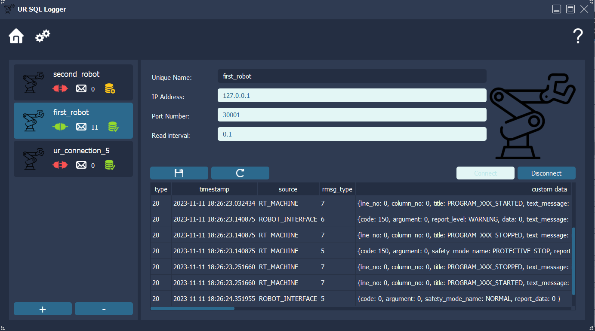

# UR SQL Logger
Application for saving log messages read from industrial robot to a SQL database.

Presentation video (YouTube) - [https://youtu.be/Qyen2PXdwu4].

## Basic information:
* language: Python 3.10.2
* design pattern - MVVM (Model - View - View Model)
* SQL database - Postgres version 15.4
* Robot model - Universal Robot UR10 e-Series, software (PolyScope) version: 5.13.1
* Database interaction library: SQLAlchemy 2.0.20
* Robot interaction library: socket (built-in), interaction via TCP/IP sockets
* GUI development library: PyQt5 version 5.15.9
* For more requirements see requirements.txt file
* Icons used for GUI development downloaded from:  
    * https://icons8.com/
    * https://freeicons.io/
    * https://www.flaticon.com/

## Repository structure
* main folder: 
    * <i>main.py</i> script - entry point for executing application
    * <i>compose.yaml</i> - definitions of containers containing SQL database and robot simulator
* <i>config</i> folder - definitions of database connections
* <i>lib</i> folder - custom modules used in application
* <i>resources</i> folder:
    * qss styles (css-like syntax for PyQt5 widget styling)
    * png icons
    * sql queries executed during database connection initialization
    * robot's messages structure reference file
* <i>tests</i> folder - simple scripts testing particular app components 

More details in relevant README.md files in particular folders. 

## Application description
Application connects to multiple robots and captures log messages using TCP/IP socket connection. Bytes stream received is decoded and stored in cache - as message objects. Then, the messages are saved in the database automatically, after predefined time interval. 

User chooses relevant DB connection (so far DB connections are defined using config\db_connections.yml file). User can connect to this database and see connection status. 

Then user can add multiple robot connections and save them in the database. Each connection can be connected and disconnected independently from the robot. The messages are being saved all the time in the background, if the database connection is active. Last messages received are shown in the GUI interface. 

Log messages from robots can be captured even without working database connection - the messages are displayed in the GUI but not stored in database. After connecting to the database, robot connections data present in cache will be merged with the data that came from the database. Connection definitions which not existed in the database earlier must be saved manually.

## Database structure

